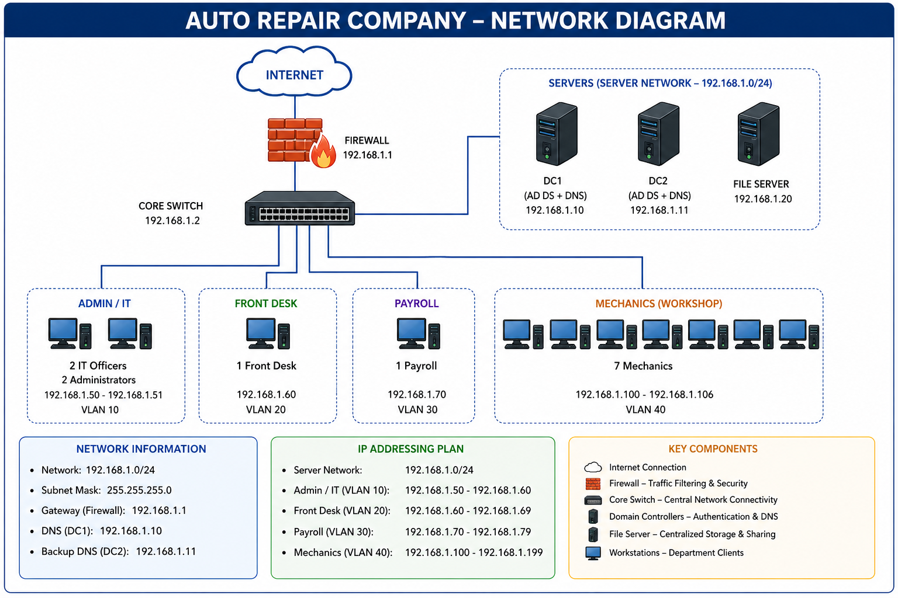
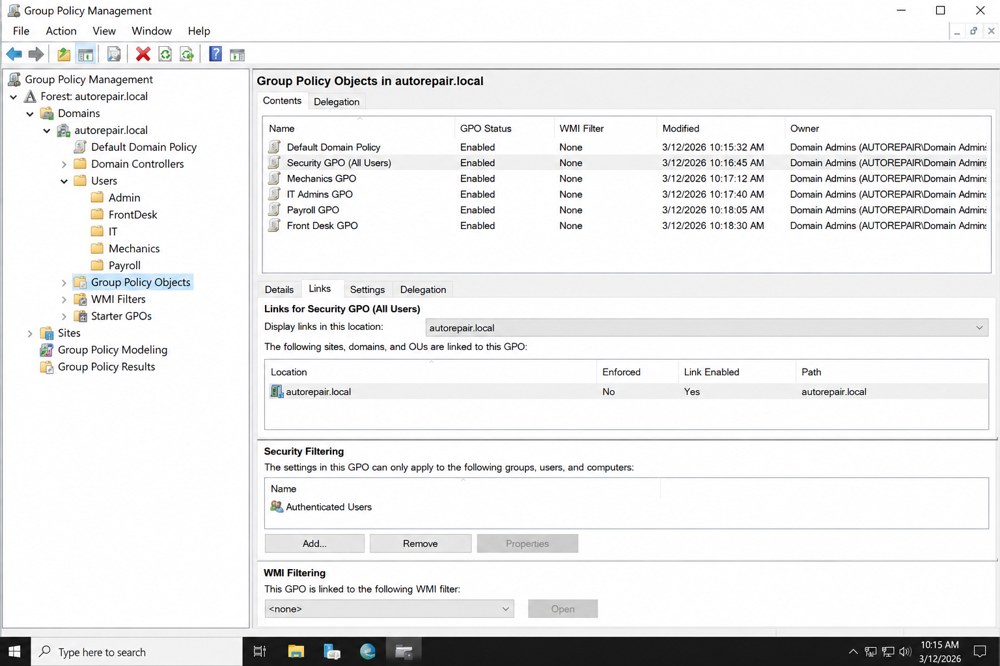

# Active Directory Deployment - Auto Repair Company (13 Users)

## 📌 Overview

Designed and implemented a production-style Active Directory environment using Windows Server 2019 to support a 13-user auto repair business.

This project demonstrates hands-on experience with identity management, system administration, troubleshooting, and IT support operations.

---

## 👥 Environment

* 7 Mechanics
* 2 IT Officers
* 1 Payroll
* 2 Administrators
* 1 Front Desk

---

## 🧱 Infrastructure

* Domain: `autorepair.local`
* 2 Domain Controllers (DC1, DC2)
* File Server for shared resources
* Services:

  * Active Directory Domain Services (AD DS)
  * DNS

---

## 🖼️ Network Architecture

 

---

## 🗂️ Active Directory Structure

* Organized using Organizational Units (OUs)
* Separate containers for:

  * Mechanics
  * IT
  * Payroll
  * Admin
  * Front Desk
* Designed for scalability and easy management

---

## 👤 Identity & Access Management (IAM)

* Implemented Role-Based Access Control (RBAC)
* Security Groups:

  * GG_Mechanics
  * GG_IT_Admins
  * GG_Payroll
  * GG_Admin
  * GG_FrontDesk
* Permissions assigned to groups (not users)
* Enforced least privilege principle

---

## 🔐 Security & Compliance

* Password policy (12+ characters, complexity enabled)
* Account lockout after 5 failed attempts
* BitLocker enabled
* Windows Defender active
* Audit logging:

  * Logon events
  * Failed access attempts
  * Administrative actions

---

## ⚙️ Group Policy (GPO)

* Restricted Control Panel (standard users)
* Screen lock enforcement
* USB restrictions (Payroll/Admin)
* Security baseline applied across domain

---

## 📸 Screenshots (Proof of Implementation)

### Active Directory Users & Computers


### Group Policy Management



### Server Manager Dashboard


---

## 🛠️ IT Operations (Help Desk Tasks)

* Created and managed user accounts
* Reset passwords and unlocked accounts
* Joined systems to domain
* Resolved login and access issues
* Managed shared folder permissions

---

## 📊 Monitoring & Reporting

* Event Viewer log analysis
* Tracked failed login attempts
* PowerShell-based reporting

---

## 💻 Automation (PowerShell)

* Automated:

  * User creation
  * OU creation
  * Group management

Example:

```powershell
New-ADUser -Name "mechanic1" -SamAccountName "mechanic1" `
-AccountPassword (ConvertTo-SecureString "P@ssword123" -AsPlainText -Force) `
-Enabled $true
```

---

## 🧪 Troubleshooting Scenarios

### 🔹 User Unable to Log In

* Checked account lockout status
* Reset password
* Verified domain connectivity
* Ran `gpupdate /force`

---

### 🔹 GPO Not Applying

* Verified OU linkage
* Ran `gpupdate /force`
* Checked security filtering

---

### 🔹 Cannot Access Shared Folder

* Verified NTFS permissions
* Checked group membership
* Confirmed GPO not restricting access

---

## 🔌 Integration

* File Server:

  * \fileserver\Mechanics
  * \fileserver\Payroll
* NTFS permissions linked to AD groups
* Backup strategy:

  * System State (AD)
  * File data backups

---

## 📊 Project Presentation

This PowerPoint provides a full walkthrough of the Active Directory deployment, including architecture, IAM design, GPO configuration, and troubleshooting scenarios.

📎 [Download Presentation](presentation/AD_Project.pptx)

---

## 🚀 Skills Demonstrated

* Active Directory Administration
* Help Desk Support
* Identity & Access Management
* Group Policy Management
* Windows Server Administration
* Troubleshooting & Monitoring

---

## 👨‍💻 Author

**HERNSLEY OSIAS**
