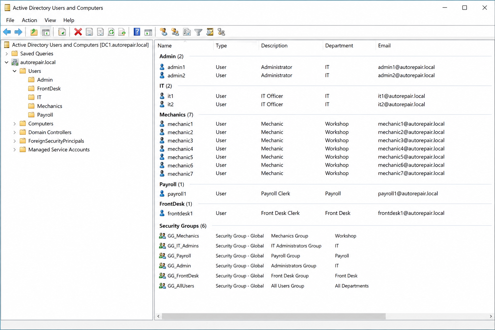
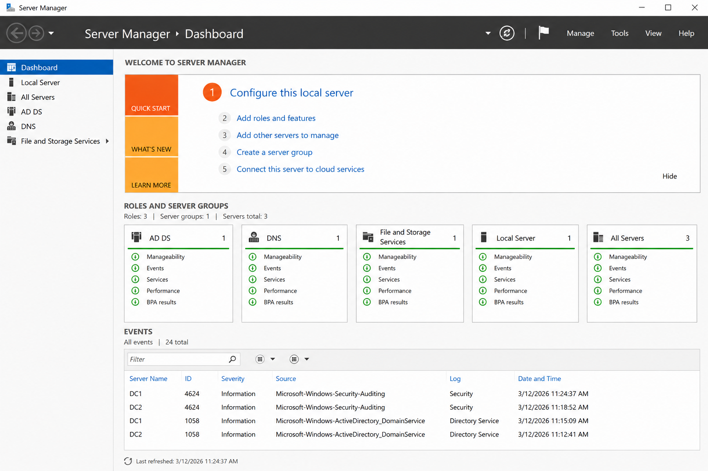

#  Active Directory Deployment – ONE STOP Auto Repair Company (13 Users)

## Project Overview

This project demonstrates the design and implementation of a secure Active Directory environment using Windows Server 2019 for a small auto repair company (ONE STOP AUTO REPAIR).

The environment supports centralized identity management, role-based access control, and secure access to company resources for 13 employees across different roles.

---

## Company Structure

* 7 Mechanics
* 2 IT Officers
* 1 Payroll
* 2 Administrators
* 1 Front Desk

---

## 🧱 Infrastructure Design

* **Domain:** autorepair.local
* **Servers:**

  * DC1 (Primary Domain Controller)
  * DC2 (Backup Domain Controller)
  * File Server (for shared resources)
* **Services:**

  * Active Directory Domain Services (AD DS)
  * DNS

---

## 🗂️ Organizational Unit (OU) Structure

The AD environment is organized to reflect business roles:

* Users

  * Mechanics
  * IT
  * Payroll
  * Admin
  * FrontDesk
* Computers
* Groups

This structure allows easy management and scalable growth.

---

## 👤 Identity & Access Management (IAM)

* Implemented **Role-Based Access Control (RBAC)**
* Created security groups:

  * GG_Mechanics
  * GG_IT_Admins
  * GG_Payroll
  * GG_Admin
  * GG_FrontDesk
* Assigned permissions to groups instead of individual users
* Applied **least privilege principle**

---

## 🔐 Security & Compliance

* Enforced password policy:

  * Minimum 12 characters
  * Complexity enabled
* Account lockout after 5 failed attempts
* Enabled:

  * BitLocker
  * Windows Defender
* Configured audit logs for:

  * Logon activity
  * Failed access attempts
  * Administrative actions

---

## ⚙️ Group Policy (GPO) Implementation

* Restricted Control Panel access for standard users
* Enforced screen lock timeout
* Applied USB restrictions for Payroll/Admin
* Configured security baseline policies

---

## 🛠️ IT Operations

* Managed users and computers using Active Directory tools
* Joined workstations to the domain
* Automated administrative tasks using PowerShell
* Supported basic troubleshooting and user access issues

---

## 📊 Monitoring & Reporting

* Used Event Viewer for system and security logs
* Monitored failed login attempts and user activity
* Generated reports using PowerShell scripts

---

## 🔌 Integration & Services

* File Server with shared folders:

  * \fileserver\Mechanics
  * \fileserver\Payroll
* NTFS permissions based on AD groups
* Implemented backup strategy:

  * System State backups (Active Directory)
  * File server backups

---

## 🖼️ Diagrams


* Network architecture (DCs, firewall, users)
* Active Directory OU structure

---

## 📸 Screenshots

*
*
*

---

## 💻 Sample PowerShell Script

```powershell
New-ADUser -Name "mechanic1" -SamAccountName "mechanic1" `
-AccountPassword (ConvertTo-SecureString "P@ssword123" -AsPlainText -Force) `
-Enabled $true
```

---

## 🚀 Skills Demonstrated

* Active Directory Administration
* Help Desk Support
* Identity & Access Management
* Group Policy Management
* Windows Server Administration
* Troubleshooting & Monitoring

---

## 📈 Project Impact

* Improved security through centralized identity management
* Reduced administrative workload using automation
* Increased system reliability with redundant domain controllers
* Built a scalable IT infrastructure for future growth

---

## 👨‍💻 Author

HERNSLEY OSIAS

---
